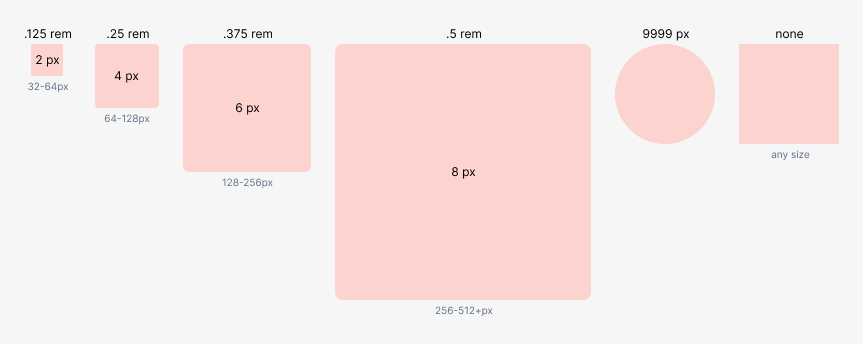
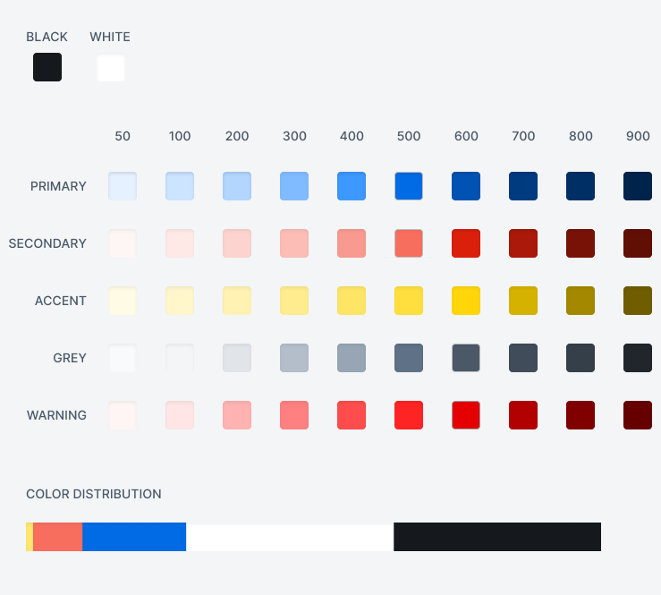

Title: Dynamic Design Systems
Published: 01/28/2020
Image: ../images/dynamicdesignsystems/coverphoto.jpeg
Author: Josh Welty
Description: Building dynamic design systems to be used across a variety of use cases
Excerpt: Building dynamic design systems to be used across a variety of use cases
---
# Dynamic Design Systems

Building a company-wide design system can mean a lot of different things for different companies' use cases. Some companies may have an intention of building a very dynamic platform. Some may want to use uniform components and branding across several products. Others may want to white-label their offerings in a variety of different ways. 

At Trinsic, we are cooking up several projects that have a lot of these needs. Over the last year or so, we've had a lot of success implementing a design system based on a concept commonly known as *atomic design*. This type of design system works for pretty much any use case. The beauty of it is that any change you make at the most basic level can reflect across all of your design files. I'll start by walking through a high level overview of how an atomic design system is structured.

To start, I think it's helpful to know how a file might be laid out. This technical approaches described in this blog are used in Figma software, although the general principles can apply to pretty much any tool. You can learn how design systems work within Figma here: [https://www.figma.com/design-systems/](https://www.figma.com/design-systems/) 

I generally use a single file, called Global Styles, in which all design system elements reside. All of our other product files are linked into Global Styles, and we can publish those to the single company-wide design system as well. More on that later though.

First, we need to define our atoms. These are the root components upon which all larger components will be based. What are our colors, typography, and icons going to look like? What kind of a sizing scale is our system going to be based on - a 4px grid or 8px? What predefined corner radii do we want to use? How about drop shadows? We want to build our kit with a clear set of definitions for all of these atomic elements. They'll become the foundation of the system. Ideally, all components will use only elements you've defined at this level.

At Trinsic, we've based our design system off of Tailwind. This system is incredibly powerful because it was built specifically for atomic design, and is optimized for incredibly efficient developer handoff. You can learn more about Tainwind here: [https://tailwindui.com](https://tailwindui.com/)

If we're building a larger component further down the line and notice an element is missing, we can go back to these atoms and add it in. This way we can make sure we don't break the "atomic chain" in which all elements are interconnected.
At this point, we can start designing and defining larger pieces: form inputs, list elements, toggle switches, cards, etc. These clements can then be re-used across whichever products you so choose. For organization, I find it helpful to have different pages within my Design System with components unique to specific products. 

This design system is intended to be a living, breathing, evolving document. Much like a government constitution, it can be amended to accommodate changing circumstances. Rebranding a line of products or creating a white-label design has never been easier. If a development team builds using a similar atomic structure, implementation of these designs will also work more effeciently. So here's how swapping out these atomic elements works:

Start by going back to those core atomic components! Edit all of the styles directly, and we'll see all of those changes reflect across the rest of our system.

But what if we want to create a white labelled file? We want to change all the styles, but doing so in the core design file will reflect those unwanted changes across our existing products. We don't want that. 

So, just like code, we can make a fork in the design system. For a highly optimized white label design system, here are a few tips that have proved useful to me.

1. Create a new file. We'll want to make sure all the master screens in our original file are published as components to our design system. This is key, because any design updates we make can reflect across all white label files.
2. Copy the original design file into the white label file. If we've turned the master page into components, all of those will be copied into this new file as child elements.
3. Detach all atomic styles we wish to change, and define new ones on a style sheet in this white label file. We can set these styles to exist only within this white label file, and not be published to the whole system. This is the step in which a fork is made in the design system.
4. Within Figma, we can download a free plugin called Style Lens: [https://www.figma.com/community/plugin/856227067026087708/Style-Lens](https://www.figma.com/community/plugin/856227067026087708/Style-Lens) . It scans the file for a single style, and is able to select all elements that contain it. Once we have selected all of the elements containing a single style, we have the ability to them all to a new one in a single click. It's incredible how powerful this tool is.
5. Once all styles have been changed to what we want, we can focus on the structure of what's actually prototyped in this file. For added customization, it's possible to hide elements from original page components (by selecting and deleting them) and build new ones to exist on top of them. 

    It's important to note that sometimes with this approach, changing the original component could cause unwanted content to appear within these child components, but it's usually an easy fix to just delete that content again.

Building design systems with an atomic structure has been a game changer for us at Trinsic. Cranking out high-fidelity design prototypes has never been faster for our team. I hope the information in this post is useful, and am always open to hearing about better ways of improving upon existing methods! Feel free to email me with any questions or ideas at josh@trinsic.id.
